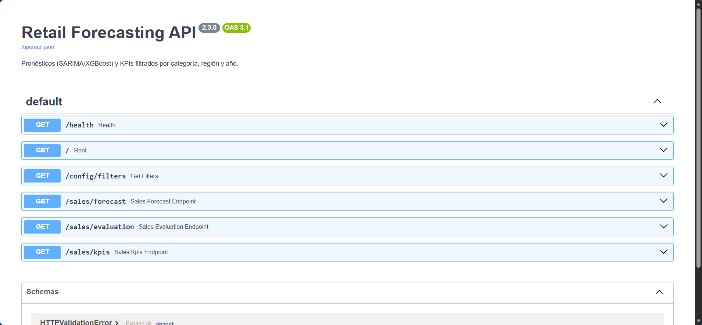
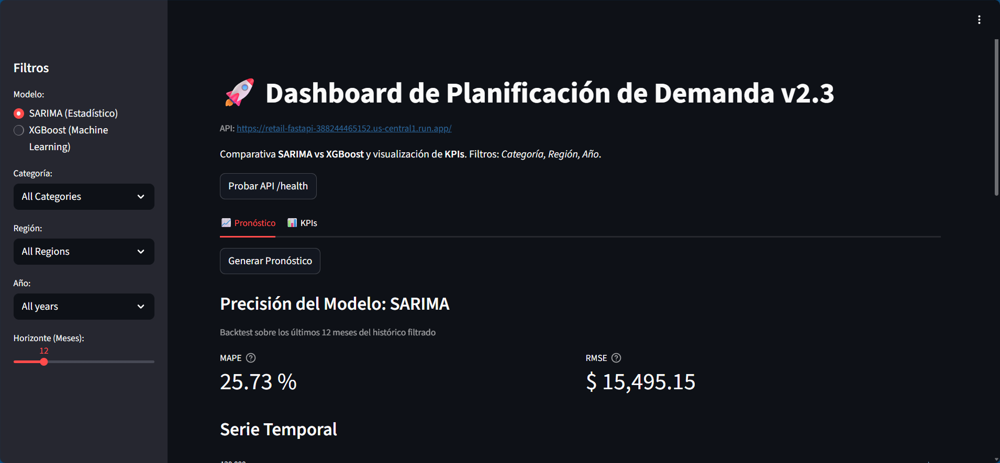
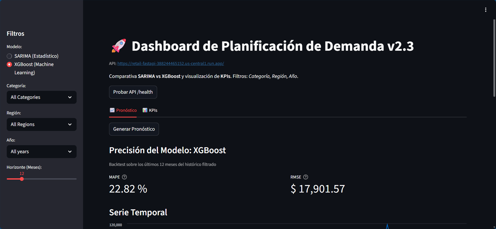
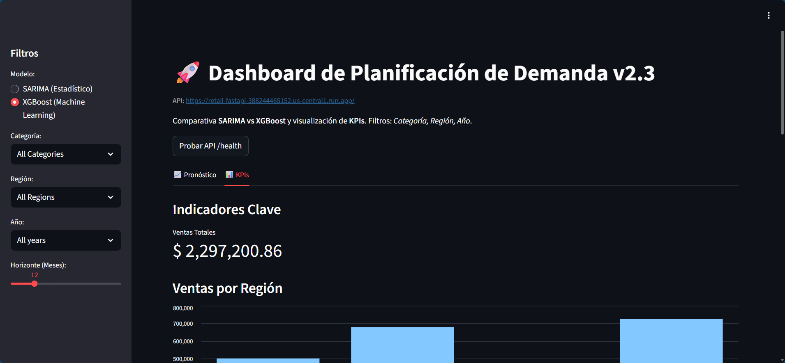

> [!NOTE]
> # group4-project-seminario
>

## Integrantes

- Ivan Ancallay
- Francis Fiallos
- Christian Mazaquisa

## Nombre caso de estudio
Pronóstico de Ventas y Optimización de Inventario para una Cadena de Retail.

Este caso utiliza el popular dataset "Superstore", que contiene 4 años de datos de ventas detallados de una gran cadena minorista en Estados Unidos. La gestión de inventario es uno de los mayores desafíos para un retailer: tener demasiado inventario inmoviliza capital y aumenta los costos, mientras que tener muy poco resulta en pérdidas de ventas. La gerencia necesita un sistema que no solo reporte las ventas pasadas, sino que pronostique las ventas futuras para diferentes categorías de productos y regiones, permitiendo una planificación de inventario proactiva y basada en datos.

## Objetivo

"Construir un sistema de pronóstico de series de tiempo que prediga la demanda de ventas a nivel semanal y mensual. El sistema deberá ser capaz de generar pronósticos no solo a nivel general, sino también filtrados por categoría de producto y región, para así ofrecer insights accionables a los gerentes de categoría y de logística."

## Descripción del Dataset

Proyecto de Tesis: Dashboard de Pronóstico de Ventas v2.0

Este proyecto es un sistema de analítica de software completo para el pronóstico de demanda, desarrollado como parte de un trabajo de titulación. La aplicación implementa una arquitectura de software desacoplada (Backend/Frontend) para predecir las ventas de una cadena de retail utilizando modelos estadísticos (SARIMA) y de Machine Learning (XGBoost).

Características Principales

Arquitectura Desacoplada: Un backend (FastAPI) para la lógica y el modelado, y un frontend (Streamlit) para la visualización.

Comparación de Modelos: Permite al usuario elegir y comparar dinámicamente el rendimiento de un modelo estadístico (SARIMA) contra un modelo de Machine Learning (XGBoost).

Pronóstico Dinámico: Filtra las ventas por Categoría y Región para generar pronósticos personalizados.

Validación de Precisión: Utiliza backtesting para calcular y mostrar métricas de error (MAPE y RMSE) para cada modelo, justificando la selección del modelo más preciso.

Análisis Exploratorio (EDA): Incluye un notebook (.ipynb) que analiza la serie de tiempo para identificar tendencia y estacionalidad, justificando la elección de los modelos.

Arquitectura del Proyecto

El proyecto está organizado en una estructura modular de 3 capas para una clara separación de responsabilidades.

### Tecnologías Utilizadas

Python 3.14

Backend (API): FastAPI, Uvicorn

Frontend (Dashboard): Streamlit

Modelado y Data Science:

Pandas (para manipulación de datos)

Statsmodels (para el modelo SARIMA)

XGBoost (para el modelo de Gradient Boosting)

Scikit-learn (para métricas y preprocesamiento de ML)

Jupyter Notebook (para el Análisis Exploratorio)

Soporte de Archivos: openpyxl, xlrd

# Cómo Ejecutar el Proyecto

## 1. Configuración Inicial (Solo la primera vez)

1.1 Clonar/Descargar: Asegúrate de que todos los archivos del proyecto estén en la carpeta desde el terminal ejecutar git clone + url_git

1.2 Abre una terminal en la carpeta raíz del proyecto.

1.3 Crear Entorno Virtual:
    python -m venv venv

1.4 Activar Entorno Virtual (Windows):
    .\venv\Scripts\Activate

1.5 Instalar Dependencias:
    pip install -r requirements.txt

## 2. Ejecución (Cada vez que inicies)

# Método 1

Iniciar el Backend (API):\
Terminal 1: Iniciar el Backend (API)\
    Abre una terminal en la raíz del proyecto.\
    Activa el entorno: .\venv\Scripts\Activate  
    Inicia el servidor Uvicorn:\ 
        uvicorn api_service:app --reload\

\

Espera a ver el mensaje: Uvicorn running on http://127.0.0.1:8000\

Iniciar el Dashboard\
Terminal 2: Iniciar el Frontend (Dashboard)\
    Activa el entorno: .\venv\Scripts\Activate  
    Inicia el servidor de Streamlit:\
    streamlit run app.py\

Página principal de Streamlit\

Modelo Sarima\

Modelo XGBoost\

KPI's Comparativos\

# Método 2
Crear un archivo llamado run_app.py el mismo que contendra los comandos para ejecutar tanto el backend como el forntend\
python run_app.py
